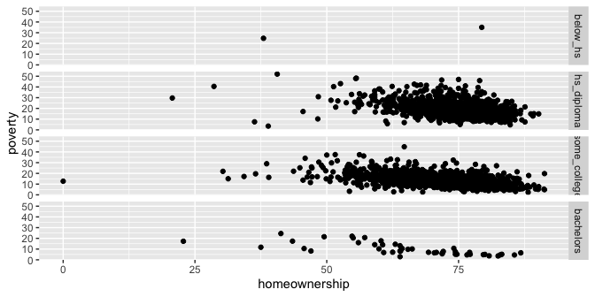
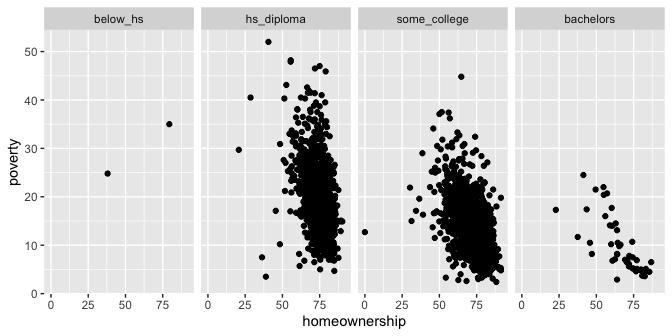

# homework-01

## Author: Hariharan Ramesh

For any exercise where you’re writing code, insert a code chunk and make
sure to label the chunk. Use a short and informative label. For any
exercise where you’re creating a plot, make sure to label all axes,
legends, etc. and give it an informative title. For any exercise where
you’re including a description and/or interpretation, use full
sentences. Make a commit at least after finishing each exercise, or
better yet, more frequently. Push your work regularly to GitHub. Once
you’re done, inspect your GitHub repo to make sure it has all the
components you want to submit in the `hw-01.md` file, including the
prose, the code, and all plots.

1.  **Road traffic accidents in Edinburgh.** Next we’ll look at traffic
    accidents in Edinburgh. The data are made available
    [online](https://data.gov.uk/dataset/cb7ae6f0-4be6-4935-9277-47e5ce24a11f/road-safety-data/datafile/36f1658e-b709-47e7-9f56-cca7aefeb8fe/preview)
    by the UK Government. It covers all recorded accidents in Edinburgh
    in 2018 and some of the variables were modified for the purposes of
    this assignment. The data can be found in the **dsbox** package, and
    it’s called `accidents`. You can find out more about the dataset by
    inspecting its documentation with `?accidents` and you can also find
    this information
    [here](https://rstudio-education.github.io/dsbox/reference/accidents.html).
    Recreate the following plot, and interpret in context of the data.

    <!-- -->

2.  **NYC marathon winners.** The New York City Marathon is an
    annual marathon (26.2 miles / 42.195 kilometers) that courses
    through the five boroughs of New York City. Marathon times of
    runners in the Men and Women divisions of the New York City Marathon
    between 1970 and 2020 can be found in the `nyc_marathon` dataset in
    the **openintro** package (which is already installed for you). You
    can find out more about the dataset by inspecting its documentation
    with `?nyc_marathon` and you can also find this information
    [here](http://openintrostat.github.io/openintro/reference/nyc_marathon.html).

    a\. Create a histogram and a box plot of the distribution of
    marathon times of all runners in the dataset. What features of the
    distribution are apparent in the histogram and not the box plot?
    What features are apparent in the box plot but not in the histogram?

    b\. Create a side-by-side box plots of marathon times for men and
    women. Use different colors for the each of the box plots – do not
    use the default colors, but instead manually define them (you can
    choose any two colors you want). Based on the plots you made,
    compare the distribution of marathon times for men and women.

    c\. What information in the above plot is redundant? Redo the plot
    avoiding this redundancy. How does this update change the
    data-to-ink ratio?

    d\. Visualize the marathon times of men and women over the years. As
    is usual with time series plot, year should go on the x-axis. Use
    different colors and shapes to represent the times for men and
    women. Make sure your colors match those in the previous part. Once
    you have your plot, describe what is visible in this plot but not in
    the others.

3.  **US counties.** The following questions use the `county` dataset in
    the **openintro** package. You can find out more about the dataset
    by inspecting its documentation with `?county` and you can also find
    this information
    [here](https://openintrostat.github.io/usdata/reference/county.html).

    a\. What does the following code do? Does it work? Does it make
    sense? Why/why not?

    ``` r
    ggplot(county) +
      geom_point(aes(x = median_edu, y = median_hh_income)) +
      geom_boxplot(aes(x = smoking_ban, y = pop2017))
    ```

    b\. Which of the following two plots makes it easier to compare 
    poverty levels  (poverty) across people from different median 
    education levels (median_edu)?  What does this say about when to
    place a faceting variable across rows or columns?

    ``` r
    ggplot(county %>% filter(!is.na(median_edu))) + 
      geom_point(aes(x = homeownership, y = poverty)) + 
      facet_grid(median_edu ~ .)
    ```

    <!-- -->

    ``` r
    ggplot(county %>% filter(!is.na(median_edu))) + 
      geom_point(aes(x = homeownership, y = poverty)) + 
      facet_grid(. ~ median_edu)
    ```

    <!-- -->

    c\. Recreate the R code necessary to generate the following graphs.
    Note that wherever a categorical variable is used in the plot, it’s
    `metro`.

    

4.  **Rental apartments in SF.** The data for this exercise comes from 
    TidyTuesday and it's on rental prices in San Francisco. You can find 
    out more about the dataset by inspecting its documentation 
    [here](https://github.com/rfordatascience/tidytuesday/tree/master/data/2022/2022-07-05). The dataset you'll be using is called `rent`.
    Create a visualization that will help you compare the distribution
    of rental prices (`price`) per bedroom (`beds`) across neighborhoods 
    (`nhood`) in the city of San Francisco (`city == "san francisco"`), 
    over time. Limit your analysis to rentals where the full unit is available,
    i.e. (`room_in_apt	== 0`). You have the flexibility to choose which years 
    and which neighborhoods. Note that you should have a maximum of 8 
    neighborhoods on your visualization, but one or more of them can be a 
    combination of many (e.g., an "other" category). Your visualization should 
    also display some measure of the variability in your data. You
    get to decide what type of visualization to create and there is more
    than one correct answer! In your answer, include a brief description of
    why you made the choices you made as well as an interpretation of the 
    findings of how rental prices vary over time and neighborhoods in 
    San Francisco.

5.  **Napoleon’s march.** The instructions for this exercise are simple:
    recreate the Napoleon’s march plot by Charles John Minard in
    ggplot2. The data is provided as a list, saved as `napoleon.rds`.
    Read it in using `read_rds()`. This object has three elements:
    `cities`, `temperatures`, and `troops`. Each of these is a data
    frame, and the three of them combined contain all of the data you
    need to recreate the visualization. Your goal isn’t to create an
    exact replica of the original plot, but to get as close to it as you
    can using code you understand and can describe articulately in your
    response. I’ll be the first to say that if you google “Napoleon’s
    march in ggplot2”, you’ll find a bunch of blog posts, tutorials,
    etc. that walk you through how to recreate this visualization with
    ggplot2. So you might be thinking, “why am I being asked to copy
    something off the internet for my homework?” Well, this is an
    exercise in (1) working with web resources and citing them
    properly, (2) understanding someone else’s ggplot2 code and
    reproducing their work, (3) describing what that code does in your
    own words, and finally (4) putting some final touches to make the
    final product your own. Some more guidelines below:

    -   You should make sure your response properly cites all of the
        resources you use. I’m defining “use” to include “browse, read,
        get inspired by, or directly borrow snippets of code from”. You
        don’t need to worry about formal citations, it’s okay to make a
        list with links to your resources and provide a brief summary of
        how you used each one.
    -   For this exercise, you’re asked to describe what your code does
        (instead of interpreting the visualization, since we already did
        that in class). If you write the code, it should be
        straightforward for you to describe it. If you borrow any code
        from outside resources, you need to understand what that code
        does, and describe it, ***in your own words***. (This is
        important, you’re allowed to use found code, but you are not
        allowed to copy someone’s blog post or tutorial as your
        description of their code.)
    -   Finally, you should personalize the visualization with your own
        touch. You can do this in a myriad of ways, e.g., change colors,
        annotations, labels, etc. This change should be made to make the
        plot more like the original in some way. You need to explicitly
        call out what change you made and why you made it.
